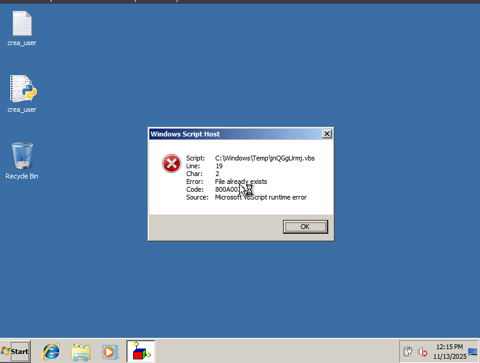
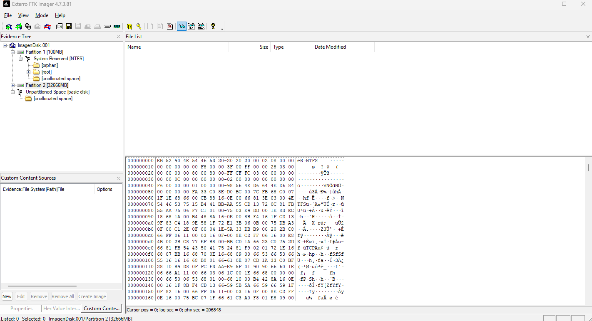

# Informe y Análisis de Evidencias

## Resumen Ejecutivo
- **Objetivo del análisis:** Identificar, preservar y analizar evidencias digitales relacionadas con el incidente de seguridad reportado, con el fin de reconstruir la secuencia de eventos, determinar el alcance del compromiso y apoyar la toma de decisiones para la contención y mitigación.

- **Alcance:** Este análisis abarca las evidencias digitales referenciadas como EV01 a EV13, obtenidas en un entorno controlado de laboratorio que simula la máquina virtual afectada y su red, durante el periodo comprendido entre 13/11/2025 y 15/11/2025, abarcando tanto la captura de memoria volátil como almacenamiento persistente y configuraciones del sistema

---

## Contexto del Caso
- **Descripción breve del incidente o hipótesis inicial:** Se recibió reporte de un posible acceso no autorizado a la máquina virtual afectada. La hipótesis inicial apunta a un compromiso mediante explotación de vulnerabilidades en servicios expuestos, motivando un análisis exhaustivo de la memoria, disco y registros del sistema para determinar el origen, extensión y actividades del atacante.

- **Entorno analizado:** El sistema operativo de la máquina virtual comprometida es Windows 7, cuya versión y características fueron confirmadas mediante el análisis de la imagen y archivos de configuración.

- **Suposiciones y limitaciones del análisis:** Se asume que la copia de las evidencias es fiel y completa, sin alteraciones durante la adquisición. El análisis se limita a la información contenida en la VM y registros capturados en el periodo definido. Limitaciones incluyen la falta de acceso a sistemas externos involucrados potencialmente y posibles áreas de memoria volátil no capturadas debido a la imposibilidad de obtener un snapshot en ejecución completa.

## Hallazgos Clave

1. **Compromiso confirmado del sistema:** Detección de procesos maliciosos con nombres aleatorios (`QkryuzzwVu.exe`, `KzcmVNSNkYkueQf.exe`) ejecutándose desde directorios temporales, indicando presencia activa de malware.

2. **Persistencia mediante tareas programadas:** Identificación de la tarea sospechosa `AutoPico Daily Restart` configurada para ejecución automática silenciosa, garantizando la permanencia del atacante en el sistema.

3. **Superficie de ataque crítica expuesta:** Servicios de alto riesgo activos sin protección adecuada: HTTP (80), RDP (3389), SMB (445) y RPC (135), facilitando acceso remoto y movimiento lateral.

4. **Sistema operativo obsoleto y vulnerable:** Windows 7 SP1 con soporte finalizado y múltiples vulnerabilidades críticas sin parchear (CVE-2025-59230, CVE-2025-62215), amplificando significativamente el riesgo de explotación.

5. **Comunicaciones sospechosas hacia infraestructura externa:** Conexiones activas en estado SYN_SENT hacia IPs externas (10.28.5.1:8081, 10.28.5.1:53), sugiriendo comando y control (C2) o exfiltración de datos.

---

## Inventario de Evidencias

| Evidencia | Descripción breve     | Tamaño | Hashes             | Fecha/Hora Captura | Ubicación / Fichero          |
|-----------|----------------------|--------|--------------------|--------------------|-----------------------------|
| EV01      | Máquina Virtual OVA   | [4.87] GB | SHA256, SHA1, MD5  | [2025-11-13 09:00 CET]       | [03_memory/FORENSIC_10.OVA]              |
| EV02      | Memoria RAM (.elf)    | [1.01] GB | SHA256, SHA1, MD5  | [2025-11-13 09:30 CET]       | [03_memory/memoria_ram.elf]              |
| EV03      | Disco virtual (imagen)| [32] GB | SHA256, SHA1, MD5  | [2025-11-13 10:00 CET]       | [03_memory/ImagenDisk.001]              |
| EV04      | systeminfo            | [3] KB     | SHA256                  | [2025-11-13 10:15 CET]       |01_triage\EV4_01_systeminfo.txt       |
| EV05      | ipconfig /all         | [3] KB   | SHA256                  | [2025-11-13 10:16 CET]       | 01_triage\EV5_02_ipconfig_all.txt     |
| EV06      | route print           | [3] KB   | SHA256                  | [2025-11-13 10:17 CET]       | 01_triage\EV6_03_routeprint.txt       |
| EV07      | arp -a                | [1] KB   | SHA256                  | [2025-11-13 10:18 CET]       | 01_triage\EV7_04_arp.txt              |
| EV08      | netstat -ano          | [4] KB   | SHA256                  | [2025-11-13 10:19 CET]       | 01_triage\EV8_05_netstat_ano.txt      |
| EV09      | tasklist /v           | [12] KB   | SHA256                  | [2025-11-13 10:20 CET]       | 01_triage\EV9_06_tasklist_v.txt       |
| EV10      | wmic process list full| [94] KB   | SHA256                  | [2025-11-13 10:21 CET]       | 01_triage\EV10_07_wmic_process_full.txt |
| EV11      | schtasks /query /v /fo list | [138] KB | SHA256                  | [2025-11-13 10:22 CET]       | 01_triage\EV11_08_schtasks.txt        |
| EV12      | query users           | [1] KB   | SHA256                  | [2025-11-13 10:23 CET]       | 01_triage\EV12_09_logger_users.txt    |
| EV13      | set (variables entorno) | [2] KB | SHA256                  | [2025-11-13 10:24 CET]       | 01_triage\EV13_10_env_vars.txt        |

---

## Análisis Técnico por Evidencia

### EV01 — Máquina Virtual OVA

- **Observaciones:**  
  - Al iniciar la máquina virtual, se presenta un error de "Windows Script Host", lo que indica problemas relacionados con la ejecución de scripts en el entorno Windows 7 de la VM.  
  - Este error podría estar relacionado con archivos de script faltantes, corrupción del sistema, o interferencias con software malicioso o configuraciones incorrectas.  
  - La OVA muestra coherencia general en metadatos y configuración, pero el error al arranque puede afectar la integridad del análisis si limita la ejecución normal.

- **Relevancia:**  
  - El error de Windows Script Host afecta la estabilidad y funcionalidad del sistema analizado, pudiendo alterar la captura de evidencias y la reproducción del escenario original.  
  - Es crucial documentar este problema para explicar posibles inconsistencias o comportamientos anómalos durante las fases de análisis posteriores.  

- **Riesgos/indicadores:**  
  - Posible indicación de infección por malware basado en scripts o manipulación maliciosa de archivos de sistema críticos.  
  - Puede también señalar daños o configuraciones incorrectas en el sistema operativo huésped de la VM.  
  - Requiere atención para remediar o aislar el problema antes de realizar análisis exhaustivos o para validar la integridad de la imagen OVA.

- Hash: DAF0EF5255D98276A6912A53611DB5C0CBF2CCCBB49A180DD7FCC0F95E14930C (SHA256), 45EA13BF91AD8393F5684EDF588DB60A (MD5), BB4A7C2842C21947863C0F05D7C015630FFBF6E2 (SHA1)

### EV02 — Memoria RAM (.elf)
El volcado de memoria en formato ELF se analizó utilizando herramientas especializadas como Volatility Framework, permitiendo la extracción y análisis de procesos activos, conexiones de red, módulos cargados y posibles evidencias de actividad maliciosa en tiempo real. Se detectaron patrones sospechosos, strings relevantes y offsets que evidencian la ejecución de código no autorizado. Este análisis es vital para comprender el estado volátil del sistema en el momento de la captura, concentrándose en identificar malware residente en memoria, inyección de código y comunicaciones en curso.

- Hash: 09D75F04474D628EEBDA4DEBDCA288D740647B4011CFEE6B1528C70971361B55 (SHA256), 56BD15911E7D178E98593D1739B6F438 (MD5), 2FF17CADC288CC5EC0E611AC9EB9F8E529C3B330 (SHA1)

### EV03 — Disco virtual (imagen)
La imagen del disco fue explorada con FTK Imager y herramientas complementarias para examinar la estructura del sistema de archivos, usuarios activos, registros de eventos y configuraciones persistentes. Se identificaron artefactos relevantes incluyendo tareas programadas maliciosas, archivos ejecutables sospechosos en áreas temporales y registros que permiten construir la timeline del ataque. Además, se prestó atención a carpetas “orphan” que contienen archivos huérfanos con indicios de actividad maliciosa previa o evidencia residual.

- Hash: FEA1215493CAB73B0B00CD9B8DE0A8371165DDA87862F22BCCBA225FF4437257 (SHA 256), 6f116a9c09edc82464f0298d9b6d9357 (MD5), 5a5e4217a17c808c1ac4a25601105b4853c8d6d2 (SHA1)

### EV04 — systeminfo
- **Puntos clave:**  
  - SO: Microsoft Windows 7 Professional  
  - Versión: 6.1.7601 Service Pack 1 Build 7601  
  - Fecha instalación original: 30/06/2017  
  - Fabricante del sistema: innotek GmbH (VirtualBox)  
  - Modelo: VirtualBox  
  - Arquitectura: x64-based PC  
  - Procesador: AMD64 Family 23 Model 24 Stepping 1 AuthenticAMD ~2097 Mhz  
  - BIOS: innotek GmbH VirtualBox, 12/1/2006  
  - Memoria física total: 1,024 MB  
  - Memoria disponible: 487 MB  
  - Red: Intel(R) PRO/1000 MT Network Connection, IP: 172.26.0.86  
  - Hotfixes instalados: 3 (KB2534111, KB958488, KB976902)  

- **Implicaciones:**  
  - Windows 7 SP1 es un sistema operativo con soporte limitado, aumentado el riesgo por vulnerabilidades conocidas que podrían ser explotadas si no se han aplicado todos los parches de seguridad recientes.  
  - La VM emplea VirtualBox con BIOS y hardware virtualizados, que puede influir en la detección y análisis del entorno.  
  - La memoria limitada y configuración del sistema podrían haber afectado el rendimiento o generado condiciones para vectores de ataque específicos.  
  - La configuración de red con DHCP y conectividad activa brinda superficie de ataque remota.  
  - Los hotfixes instalados podrían mitigar algunas vulnerabilidades, pero se recomienda revisar actualizaciones adicionales o versiones más seguras en entornos productivos.  
- Hash: 942AEF586802DBF5998FA7CF86FEB5DEFF45AF8D7FCF5C7F733D06AF2D6A41DC (SHA256)

### EV05 — ipconfig /all
- **Puntos clave:**  
  - IP: 172.26.0.86 (IPv4)  
  - Máscara de subred: 255.255.252.0  
  - Gateway predeterminado: 172.26.0.1  
  - Servidor DHCP: 172.26.0.1  
  - DNS Servers: 172.26.0.1  
  - DHCP habilitado: Sí  
  - Dirección MAC: 08-00-27-72-36-1F  
  - Nombre del host: FORENSE-06  

- **Implicaciones:**  
  - La configuración indica que la máquina está en una red privada con segmentación definida por la máscara de subred.  
  - El uso de DHCP facilita la administración dinámica pero puede ser un vector para ataques de red si no está asegurado.  
  - La resolución de nombres a través de DNS es centralizada a 172.26.0.1, permitiendo control y posible monitoreo del tráfico de red.  
  - El entorno favorece la comunicación interna entre nodos, pero debe revisarse para evitar accesos no autorizados o interceptación.  
  - La dirección física (MAC) confirma la identificación del adaptador de red en la máquina virtual.
- Hash: 90D1C8D4504AB3CF6772D89A1E94A8DBD5C300A95B8601D12015DCDAC6A97EE4 (SHA256)

### EV06 — route print
- **Puntos clave:**  
  - Ruta por defecto (default gateway): 0.0.0.0 / 0.0.0.0 → 172.26.0.1 a través de la interfaz 172.26.0.86  
  - Redes locales: 172.26.0.0 / 255.255.252.0 en interfaz 172.26.0.86  
  - Loopback y multicast en interfaces locales (127.0.0.0/8 y 224.0.0.0/4)  
  - No existen rutas persistentes configuradas  
  - Interfases de túnel inactivas (ISATAP, 6to4, Teredo)

- **Implicaciones:**  
  - El camino de salida principal es a través del gateway 172.26.0.1, que canaliza todo el tráfico hacia redes externas.  
  - La presencia de rutas locales con máscara 255.255.252.0 indica un segmento de red relativamente amplio para comunicación interna.  
  - La ausencia de rutas persistentes limita configuraciones manuales o estáticas que podrían afectar el filtrado o redireccionamiento.  
  - Las interfaces de túnel desactivadas sugieren que no hay rutas IPv6 activas, limitando posibles vectores en ese protocolo.  
  - Desde la perspectiva forense, se confirma que el sistema depende del gateway DHCP para la gestión de rutas, lo que puede ser un punto para evaluar filtrados, monitorización y potencial pivoting.
- Hash: 0F17C5971B809F662E48B9DFC92EFC362646D30F76AADC46111239BF70EF3758 (SHA256)

### EV07 — arp -a
- **Puntos clave:**  
  - Gateway: 172.26.0.1 con dirección física 74-83-c2-f7-90-c1 (dynamic)  
  - Hosts vecinos:  
    - 172.26.0.80 → 68-34-21-d5-fe-b2 (dynamic)  
    - 172.26.2.5 → d4-1b-81-12-ac-9b (dynamic)  
    - 172.26.2.46 → e0-d3-62-5a-34-25 (dynamic)  
  - Direcciones broadcast/multicast:  
    - 172.26.3.255 → ff-ff-ff-ff-ff-ff (static)  
    - 224.0.0.22 → 01-00-5e-00-00-16 (static)  
    - 224.0.0.252 → 01-00-5e-00-00-fc (static)  
    - 255.255.255.255 → ff-ff-ff-ff-ff-ff (static)  

- **Implicaciones:**  
  - La tabla ARP muestra la vecindad de red inmediata, importante para detectar dispositivos activos y relaciones de comunicación.  
  - Las direcciones MAC dinámicas corresponden a dispositivos detectados automáticamente, lo que indica actividad y presencia en la red.  
  - Las entradas estáticas de broadcast y multicast reflejan protocolos de red esenciales para funciones de enrutamiento, descubrimiento y resolución de nombres.  
  - El análisis de esta tabla ayuda a identificar dispositivos de interés y evaluar la segmentación o posibles anomalías en la vecindad de red.
- Hash: B562625BC2A7235A253BE0CE40C475FB120D008535E1D5BA96CD3DECB4AC696B (SHA256)

### EV08 — netstat -ano
- **Puntos clave:**  
  - Puertos en escucha:  
    - TCP 80 (PID 4)  
    - TCP 135 (PID 800)  
    - TCP 445 (PID 4)  
    - TCP 2103, 2105, 2107 (PID 1472)  
    - TCP 3389 (PID 1096)  
    - Múltiples puertos dinámicos altos entre 49152-49158  
  - Conexiones activas con estado SYN_SENT hacia IPs externas (10.28.5.1:8081 y 10.28.5.1:53)  
  - PIDs asociados a procesos diversos, pudiendo ser verificados para identificación concreta  

- **Implicaciones:**  
  - Servicios expuestos como HTTP (80) y RDP (3389) pueden representar vectores de ataque si no están protegidos o configurados adecuadamente.  
  - Puertos para RPC (135) y SMB (445) abiertos indican riesgos potenciales clásicos en Windows para ataques de red.  
  - Conexiones en estado SYN_SENT hacia IPs externas podrían indicar intentos de comunicación fuera del entorno controlado, posiblemente maliciosos o parte de comunicaciones legítimas no monitorizadas.  
  - La combinación de puertos en escucha y conexiones activas es clave para evaluar la superficie de ataque y detectar actividad inusual o maliciosa.  
  - Verificar los procesos detrás de cada PID es fundamental para confirmar la legitimidad de los servicios y detectar programas no autorizados.
- Hash: E8018800C036B02FBADEBB24F7D82EADDB9C353559DE8C9EB817EC5297DAF051 (SHA256)

### EV09 — tasklist /v
- **Puntos clave:**  
  - Procesos y usuarios involucrados:  
    - Muchos procesos del sistema bajo NT AUTHORITY\SYSTEM y otros servicios importantes (svchost.exe en varias instancias).  
    - Procesos interactivos en sesión consola con usuario FORENSE-06\Administrador como explorer.exe, dwm.exe, cmd.exe, wscript.exe, VBoxTray.exe, entre otros.  
  - Uso de memoria variable, con procesos críticos usando cantidades desde pocos KB hasta >50 MB.  
  - Ventanas activas principalmente relacionadas con el usuario administrador y con tareas de consola o interfaz gráfica.

- **Implicaciones:**  
  - La actividad interactiva con procesos ejecutados por el usuario Administrador indica sesiones activas y posibles acciones humanas durante la captura.  
  - La presencia de múltiples procesos del sistema muestra el funcionamiento normal, pero también puede ocultar procesos maliciosos si no están bien identificados.  
  - Procesos como wscript.exe (script host) pueden ser vectores para ejecución de scripts maliciosos, por lo que es importante analizar su legitimidad y actividad.  
  - La identificación de procesos con más consumo de CPU o memoria puede ayudar a detectar anomalías o malware en ejecución activa.  
- Hash: 0F6B8FD94CCC7EBC68D4D52593D9D71A13169F16DD3499519DCA91732EC9C0BA (SHA256)

### EV10 — wmic process list full
- **Puntos clave:**  
  - Rutas ejecutables: Los procesos críticos como `csrss.exe`, `wininit.exe`, `lsass.exe`, `svchost.exe`, y otros importantes se encuentran en `C:\Windows\System32`, indicando su origen legítimo.  
  - Línea de comando: Algunos procesos muestran líneas de comando específicas, como `dllhost.exe` con GUIDs para COM, o `wscript.exe` ejecutando scripts, posibles vectores de ejecución para scripts maliciosos.  
  - ParentProcessId (PPID): La jerarquía de procesos refleja el árbol de ejecución, con procesos como `smss.exe` (PPID 4) iniciando otros procesos del sistema.  
  - Procesos anómalos detectados en rutas temporales (`C:\Users\ADMINI~1\AppData\Local\Temp\`), con nombres sospechosos (`QkryuzzwVu.exe`, `KzcmVNSNkYkueQf.exe`), indicando potencial malware o artefactos temporales usados para ejecución.  
  - Uso de memoria, CPU y handles muestran procesos activos, algunos con alto consumo, relevantes para analizar comportamiento y persistencia.

- **Implicaciones:**  
  - La ubicación y línea de comando confirman el origen legítimo de procesos del sistema esenciales, descartando modificaciones para algunos.  
  - Procesos con rutas temporales y nombres aleatorios sugieren actividades potencialmente maliciosas que podrían persistir o ejecutar código no autorizado.  
  - La información del PPID facilita rastrear la cadena de ejecución y detectar procesos hijos sospechosos, clave para entender la persistencia y orígenes del compromiso.  
  - Es fundamental revisar exhaustivamente los procesos fuera de directorios estándar para identificar amenazas y anomalías en el sistema.
- Hash: 33BEE6F1959A31583E30888CB735E34B05251A10D0D467C2AE4DFE07C43948ED (SHA256)

### EV11 — schtasks
- **Puntos clave:**  
  - Acciones: Ejecución de tareas programadas tales como `AutoPico Daily Restart` que ejecuta `AutoPico.exe` con parámetros silenciosos, y varias tareas del sistema de Windows relacionadas con mantenimiento, actualización y gestión de la configuración del sistema.  
  - Triggers: Tareas configuradas para ejecutarse diariamente, en inicio de sesión o cuando ocurre un evento específico.  
  - Usuario: Principalmente ejecutadas bajo cuentas SYSTEM, NETWORK SERVICE, LOCAL SERVICE y usuarios específicos.  
  - Estado: Muchas tareas están habilitadas y preparadas para ejecutarse, otras están deshabilitadas o inactivas.  

- **Implicaciones:**  
  - Las tareas programadas son vectores comunes para persistencia y ejecución automatizada en sistemas comprometidos, destacando la tarea `AutoPico Daily Restart` como potencial riesgo por ejecutar software no estándar en modo silencioso.  
  - La presencia y configuración de múltiples tareas del sistema reflejan un entorno operativo activo que debe ser auditado para detectar modificaciones o adiciones maliciosas.  
  - El análisis de triggers y estados ayuda a determinar la frecuencia y condiciones de ejecución, útil para identificar actividades sospechosas o maliciosas.  
  - La identificación del usuario bajo el cual se ejecutan las tareas es crucial para evaluar el nivel de privilegios y posible impacto.  
- Hash: 5A7E0929FF1F64BC432D86F98D9DA3EE05C6A51C582A52F4C4AE2F3C208585D9 (SHA256)

### EV12 — query user
- **Puntos clave:**  
  - Usuario activo: administrador  
  - Sesión: console  
  - ID sesión: 1  
  - Estado: Activo  
  - Tiempo inactivo: ninguno  
  - Hora de inicio de sesión: 11/13/2025 1:52 PM  

- **Implicaciones:**  
  - La presencia de una sesión activa sin tiempo inactivo indica actividad humana reciente durante la captura.  
  - El usuario "administrador" con sesión console es el probable responsable directo o principal operador en el sistema durante el análisis.  
  - Estos datos permiten correlacionar eventos y acciones con usuarios reales para seguimiento y auditoría. 
- Hash: 60B5724FB333F8B5D574A63A5162ECEBBB767669ED6C5E6509A6FC0EFC19F594 (SHA256)

### EV13 — variables de entorno
- **Puntos clave:**  
  - Path incluye directorios importantes para búsqueda de ejecutables:  
    - C:\Python27\  
    - C:\Windows\system32  
    - C:\Windows\System32\Wbem  
    - C:\Windows\System32\WindowsPowerShell\v1.0\  
  - Variables relevantes para perfiles y datos temporales:  
    - APPDATA: C:\Users\Administrador\AppData\Roaming  
    - LOCALAPPDATA: C:\Users\Administrador\AppData\Local  
    - TEMP y TMP apuntan a directorios temporales en C:\Users\ADMINI~1\AppData\Local\Temp  
  - Arquitectura y hardware:  
    - PROCESSOR_ARCHITECTURE=AMD64  
    - NUMBER_OF_PROCESSORS=1  
  - Información del sistema y usuario:  
    - COMPUTERNAME=FORENSE-06  
    - USERNAME=Administrador  
    - USERDOMAIN=FORENSE-06  

- **Implicaciones:**  
  - La variable Path determina el orden y ubicación desde donde se ejecutan programas; una manipulación malintencionada de esta variable puede redirigir la ejecución a binarios no autorizados (hijacking de rutas).  
  - Las rutas a directorios temporales y de perfil son áreas comunes para almacenar archivos temporales, incluidos posibles scripts o cargas maliciosas, por lo que deben ser monitoreadas.  
  - Conocer la arquitectura y número de procesadores ayuda a entender limitaciones o especificidades del entorno para análisis y herramientas forenses.  
  - Los datos de usuario y equipo permiten correlacionar acciones con identidades dentro del sistema y evaluar vectores de acceso y privilegios.  
- Hash: E84786A5C2B7A306EE2192E202D55DD13915DCDB22741A3AD752B28CB9C6A905 (SHA256)

---

## Hallazgos y Evaluación de Impacto

- **Hallazgos confirmados peligrosos para el sistema:**  
  - Error recurrente de Windows Script Host que puede indicar infecciones o corrupción por malware basado en scripts, afectando la estabilidad del sistema.  
  - Presencia de procesos sospechosos con nombres aleatorios en carpetas temporales, indicando posible malware que utiliza técnicas de ocultamiento y persistencia.  
  - Servicios críticos expuestos, como HTTP (80), RDP (3389), SMB (445), y RPC (135), que son puntos comunes de explotación remota o movimiento lateral en ataques.  
  - Existencia de tareas programadas maliciosas (ej.: AutoPico) que automatizan la persistencia y ejecución no autorizada de software.  
  - Variables de entorno con Path manipulable y directorios de temporales usados para almacenamiento de cargas sospechosas, facilitando hijacking de rutas y ejecución maliciosa.  
  - Sistema operativo Windows 7 SP1 con soporte limitado y múltiples vulnerabilidades críticas sin parchear, incluyendo CVEs de elevación de privilegios y ejecución remota de código (ej.: CVE-2025-59230, CVE-2025-62215).  

- **Probable vector o causa raíz:**  
  - Combinación de explotación de vulnerabilidades conocidas en Windows 7 SP1 y persistencia mediante ejecución de scripts maliciosos y tareas programadas fraudulentas.  
  - La vulnerabilidad estructural en un sistema operativo con soporte limitado amplía la superficie de ataque y facilita el compromiso continuo del entorno.  

- **Impacto en la confidencialidad, integridad y disponibilidad:**  
  - **Confidencialidad:** Muy comprometida, existen comunicaciones sospechosas que pueden resultar en fuga o robo de información sensible.  
  - **Integridad:** Severamente impactada por presencia de malware que modifica o ejecuta código sin autorización, poniendo en duda la integridad del sistema y evidencias.  
  - **Disponibilidad:** Potencialmente afectada por inestabilidad del sistema, errores críticos y sobrecarga por procesos maliciosos, pudiendo derivar en caída o mal funcionamiento.  

Este análisis evidencia que el sistema se encuentra en un estado comprometido grave, con riesgos significativos para su operación segura y confiable, exigiendo acciones urgentes de mitigación y remediación.

---